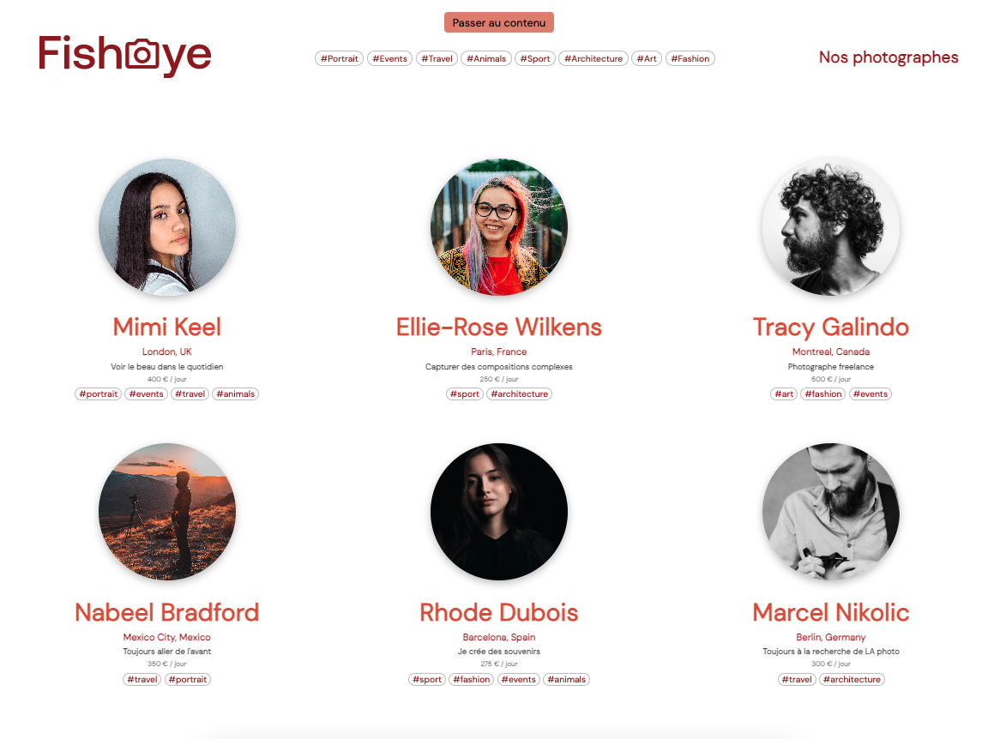

# FishEye

FishEye[^1] is a website allowing independent photographers to show their best work.

**Goal of this project**: Integration with HTML + CSS + JS, fetch and use of JSON data, and accessibility.

## Load specifications

### Website designs

The desktop and mobile designs are available on [Figma](https://www.figma.com/file/pt8xJxC1QffW4HX16QhGZJ/UI-Design-FishEye-FR-OLD). The website must be fully responsive.



### Features

- Home page:
    * All datas are fetched from a JSON file.
    * If user clicks on a tag / several tags in the navigation bar, the list of photographers is filtered to only show the ones containing this tag / those tags.
    * The photographer's page is shown if user clicks on a photographer.
- Photographer's pages:
    * Navigation on a photographer's page is done with their ID as an URL parameter to fetch only one photographer in JSON file.
    * A gallery of pictures and videos is shown. If there's a video, a thumbnail is shown.
    * If user clicks on "Like" icon, the number of likes of the picture and the total number of likes for the photographer is increased.
    * The total number of likes for the photographer is the sum of all pictures' likes.
    * If user clicks on a media, the media is shown in a lightbox (with arrows and close cross).
    * Medias can be sorted by popularity, date or title (and lightbox navigation is updated).
    * If the contact button is clicked, a modal with a form (first name, last name, e-mail address and message) is shown.
    * Error messages are shown if the form is invalid. The form is not submitting and data are retained.

### Technical constraints

- Use ESLint to ensure robust code.
- Use JavaScript ES6+, with no obsolete feature.
- Use Factory Method pattern to create a modular web application.
- Ensure accessibility of the website:
    * Use semantic tags instead of `<div>`or `<span>`.
    * Use ARIA tags to describe elements.
    * Verify keyboard navigation for whole website.
    * Handle events with clicks and keyboard navigation.
    * Add text description on each picture (with alt-text attributes in JSON).
    * Check website with AChecker without known issues (WCAG conformity).
    * Use a screen reader to test website's use.


## Launch

### GitHub Pages

The page is available at <https://aurelianeg.github.io/fisheye/> on GitHub Pages.

### Cloning

1. Clone the repository

```sh
git clone https://github.com/aurelianeg/fisheye.git
```

2. Launch the project with Live Server

```sh
live-server
```

It opens the website to view it in the browser. The page will reload when changes are made in the code.


[^1]: This is the 4th project of the "Front-end developer (JS - React)" training by OpenClassrooms.